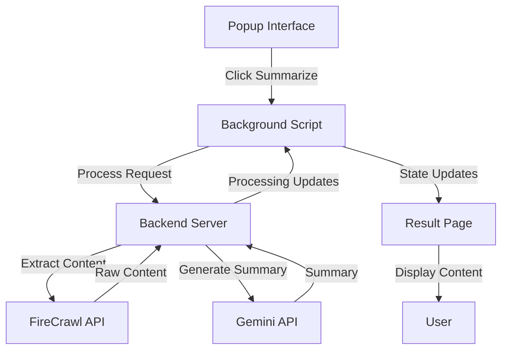

# Architecture Overview

## System Components

The Page Processor Chrome Extension is built with a distributed architecture consisting of three main components:

1. **Chrome Extension Frontend**
   - Popup Interface
   - Background Script
   - Result Page
   - Content Scripts

2. **Python Backend Server**
   - FastAPI Server
   - Content Processing Pipeline
   - AI Integration

3. **External Services**
   - FireCrawl API
   - Google Gemini API

## Component Interaction Flow

## Key Components

### 1. Chrome Extension Frontend

#### Popup Interface (`popup/`)
- User interaction point
- Backend connection status
- Processing initiation
- Error handling

#### Background Script (`background/`)
- Message routing
- State management
- Tab management
- Processing coordination

#### Result Page (`pages/result/`)
- Content display
- Processing status
- UI state management
- Light mode support

### 2. Python Backend (`backend/`)

#### FastAPI Server (`app.py`)
- HTTP endpoints
- Request handling
- Error management
- Status tracking

#### Content Processing (`page_processor.py`)
- Processing orchestration
- Content validation
- Error handling
- State management

#### FireCrawl Integration (`firecrawl_extractor.py`)
- Content extraction
- HTML processing
- Content cleaning
- Metadata extraction

#### Gemini Integration (`gemini_summarizer.py`)
- AI summarization
- Content optimization
- Format handling

### 3. Utilities (`utils/`)

#### Storage Management (`storage.js`)
- Chrome storage operations
- State persistence
- History management

#### API Communication (`api.js`)
- Backend requests
- Response handling
- Error management

## Communication Patterns

### 1. Internal Communication
- Chrome messaging system for extension components
- Event-based communication between UI components
- State updates via Chrome storage

### 2. External Communication
- HTTP/REST for backend communication
- WebSocket for real-time updates
- API calls to external services

## State Management

### 1. Processing State
- Initiated
- Extracting
- Processing
- Summarizing
- Completed
- Error

### 2. UI State
- Initial
- Processing
- Content
- Error

### 3. Storage State
- Processing history
- User preferences
- Cached content

## Security Considerations

1. **API Security**
   - Secure key storage
   - Request validation
   - Response sanitization

2. **Content Security**
   - CSP implementation
   - XSS prevention
   - Content sanitization

3. **Data Privacy**
   - Local storage only
   - No user tracking
   - Temporary data handling

## Performance Optimization

1. **Content Processing**
   - Parallel processing
   - Content chunking
   - Cache management

2. **UI Performance**
   - Lazy loading
   - Progressive rendering
   - Resource optimization

## Error Handling

1. **Frontend Errors**
   - Network errors
   - Processing errors
   - UI state errors

2. **Backend Errors**
   - API errors
   - Processing errors
   - Resource errors

## Development Workflow

1. **Local Development**
   - Component testing
   - Integration testing
   - End-to-end testing

2. **Deployment**
   - Version management
   - Release process
   - Update handling 