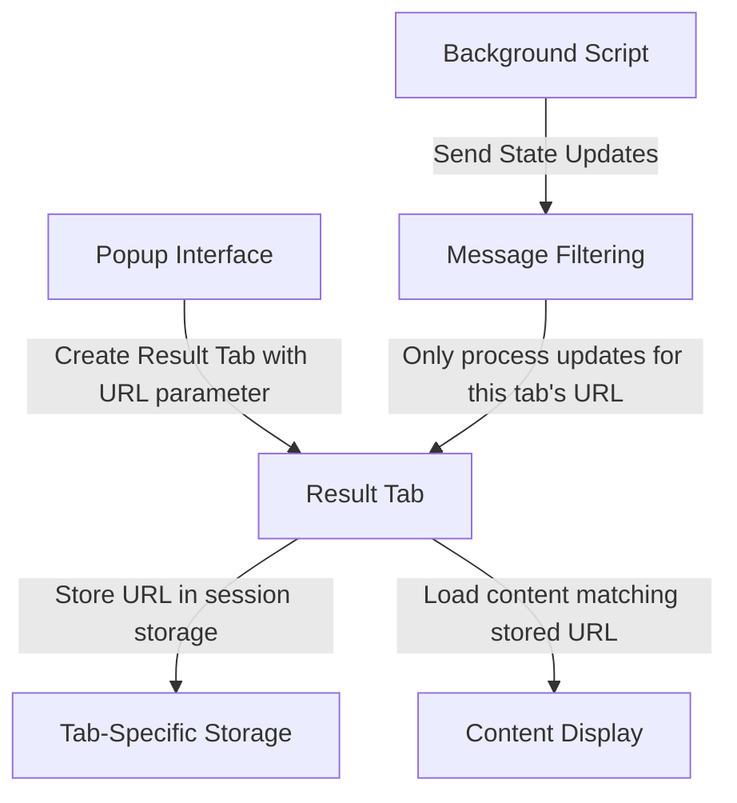

# Tab Independence Mechanism

## Overview

The Chrome extension implements a tab independence mechanism that allows each result tab to maintain its own state and display content specific to its target URL. This ensures that when multiple pages are processed simultaneously, each result tab displays only the content relevant to its specific URL, preventing state conflicts and content mixing.

## Implementation Approach

The tab independence is achieved through a combination of URL parameters, session storage, message filtering, and content-specific loading:



## Key Components

### 1. URL Parameter Passing (`popup/popup.js`)

When creating a result tab, the URL parameter is included in the tab URL:

```javascript
// Create a new result tab with the URL parameter
chrome.tabs.create({
    url: chrome.runtime.getURL(`pages/result.html?url=${encodeURIComponent(tab.url)}`),
    active: true
});
```

### 2. URL Storage in Session Storage (`pages/result/index.js`)

The result page initializes by extracting and storing the URL parameter:

```javascript
async function initializeResultPage() {
    // Extract and store the target URL for this tab
    const urlParams = new URLSearchParams(window.location.search);
    const targetUrl = urlParams.get('url');
    if (targetUrl) {
        sessionStorage.setItem('targetUrl', targetUrl);
        console.log('[DEBUG] Tab initialized for URL:', targetUrl);
    } else {
        console.warn('[WARN] No target URL specified for this tab');
    }
    
    // Continue with initialization
    // ...
}
```

### 3. Tab Registration with URL (`pages/result/processing.js`)

When registering with the background script, the tab includes its target URL:

```javascript
export function registerWithBackgroundScript() {
    // Get the URL this tab is responsible for
    const targetUrl = sessionStorage.getItem('targetUrl');
    
    chrome.runtime.sendMessage({
        type: 'result_page_ready',
        url: targetUrl // Include the URL this tab is responsible for
    }, function(response) {
        // Handle response
        // ...
    });
}
```

### 4. Message Filtering by URL (`pages/result/processing.js`)

The result page only processes updates for its specific URL:

```javascript
export function setupProcessingMessageListener() {
    // Get the URL this tab is responsible for
    const targetUrl = sessionStorage.getItem('targetUrl');
    
    chrome.runtime.onMessage.addListener((message, sender, sendResponse) => {
        if (message.type === 'processing_update') {
            // If this message is not for our URL, ignore it
            if (targetUrl && message.state && message.state.url !== targetUrl) {
                console.log('[DEBUG] Ignoring update for different URL:', message.state.url);
                sendResponse({ received: true, ignored: true });
                return;
            }
            
            // Process the update
            // ...
        }
        
        // Always send a response
        sendResponse({ received: true });
    });
}
```

### 5. URL-Specific Content Loading (`pages/result/content.js`)

The result page loads content specific to its URL:

```javascript
export async function loadAndDisplayLatestContent() {
    // Get the URL this tab is responsible for
    const targetUrl = sessionStorage.getItem('targetUrl');
    
    // Get all available content
    const contents = await storageManager.getAllContent();
    
    // Try to find content for this tab's URL first
    let contentToDisplay = null;
    
    if (targetUrl) {
        contentToDisplay = contents.find(item => item.url === targetUrl);
    }
    
    // Fall back to most recent if no match
    if (!contentToDisplay && contents.length > 0) {
        contentToDisplay = contents[0];
    }
    
    // Display the content
    // ...
}
```

### 6. Background Script Tab Registration (`background/processing/handler.js`)

The background script acknowledges the tab's URL association:

```javascript
handleResultPageReady(sender, message) {
    if (sender.tab && sender.tab.id) {
        const update = { resultTabId: sender.tab.id };
        
        // If the message contains a URL, associate it with this tab
        if (message && message.url) {
            console.log(`[DEBUG] Registering tab ${sender.tab.id} for URL: ${message.url}`);
        }
        
        this.state.update(update);
    }
    return { acknowledged: true };
}
```

### 7. Robust Tab Messaging System (`background/background.js`)

The background script implements a reliable tab messaging system with validation and error handling:

```javascript
// Helper function to send message to a specific tab
function sendMessageToTab(tabId, message) {
    return new Promise((resolve, reject) => {
        // First check if the tab exists and is in a valid state
        chrome.tabs.get(tabId, (tab) => {
            if (chrome.runtime.lastError) {
                // Tab doesn't exist anymore
                reject({tabMissing: true, error: chrome.runtime.lastError});
                return;
            }
            
            // Tab exists, try to send the message
            chrome.tabs.sendMessage(tabId, message, response => {
                if (chrome.runtime.lastError) {
                    reject(chrome.runtime.lastError);
                } else {
                    resolve(response);
                }
            });
        });
    });
}

// Helper function to broadcast to all result tabs
function broadcastToResultTabs(message) {
    // Create a safe copy of resultTabs to iterate over
    const tabsToUpdate = [...resultTabs];
    const failedTabs = [];
    
    tabsToUpdate.forEach(tabId => {
        sendMessageToTab(tabId, message)
            .catch(error => {
                if (error.tabMissing) {
                    // Tab doesn't exist anymore, remove it from tracking
                    failedTabs.push(tabId);
                    console.log('[INFO] Removing non-existent tab from tracking:', tabId);
                } else {
                    console.error('[ERROR] Failed to send message to tab:', tabId, error);
                }
            });
    });
    
    // Clean up any failed tabs from our resultTabs array
    if (failedTabs.length > 0) {
        resultTabs = resultTabs.filter(id => !failedTabs.includes(id));
        console.log('[DEBUG] Updated result tabs after removing failed tabs:', resultTabs);
    }
}
```

This implementation ensures:
1. **Tab Validation**: Verifies a tab still exists before attempting to send a message
2. **Self-Cleaning**: Automatically removes tabs from tracking when they're closed or no longer accessible
3. **Error Differentiation**: Distinguishes between missing tabs and actual messaging errors
4. **Safe Iteration**: Uses a copy of the tab list to prevent modification issues during iteration

## Data Flow

### 1. Tab Creation Flow

```
User clicks "Process" in popup
    │
    ▼
Create result tab with URL parameter
    │
    ▼
Result tab loads
    │
    ▼
Extract URL parameter and store in session storage
    │
    ▼
Register with background script (including URL)
    │
    ▼
Setup message listeners filtered by URL
    │
    ▼
Tab ready to receive updates
```

### 2. Processing Update Flow

```
Processing update occurs in background script
    │
    ▼
Background broadcasts update to all tabs
    │
    ▼
Result tab receives update
    │
    ▼
Tab checks if update URL matches its target URL
    │
    ▼
If URL matches → Process update
If URL doesn't match → Ignore update
```

### 3. Content Loading Flow

```
Result tab needs to display content
    │
    ▼
Get tab's target URL from session storage
    │
    ▼
Retrieve all stored content
    │
    ▼
Find content matching tab's URL
    │
    ▼
If matching content found → Display it
If no matching content → Fall back to most recent content
```

## Benefits

1. **Independent Processing**: Each tab only responds to updates for its specific URL.
2. **Isolated Content**: Content displayed in each tab is specific to its URL.
3. **Reduced Conflicts**: State updates for one URL do not affect tabs displaying other URLs.
4. **Improved User Experience**: Users can process multiple URLs simultaneously without confusion.

## Browser Compatibility

This approach works across all modern browsers that support:
- URLSearchParams API
- Session Storage
- Chrome Extension Messaging

## Future Improvements

Potential improvements to the tab independence mechanism include:

1. **Persistent Associations**: Storing tab-URL associations in chrome.storage for persistence across browser restarts.
2. **Tab Groups**: Grouping related tabs together for better organization.
3. **Tab Title Updates**: Setting tab titles based on the processed content.
4. **Tab Favicons**: Setting tab favicons based on the source URL.
5. **Tab State Persistence**: Saving tab scroll position and UI state. 